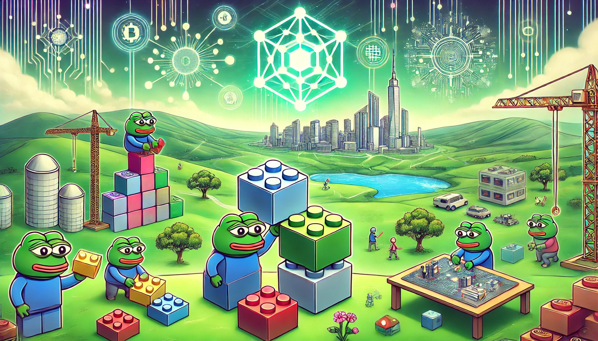

# 🧱 Welcome


**NOTE:** The content in these docs is a _bit_ outdated. We now have an updated "blurb" description of what Monea is becoming (as of July 6th, 2024). [Please check out our website](https://monea.xyz) for a more accurate description. I swear I'll update these docs soon :) – Jacob D. Castro, CEO


<figure><figcaption>
Rollup Legos 🧱
</figcaption></figure>

Thanks for checking out the **absolute earliest version** of our docs!

We're building the unopinionated platform Rollup Legos 🧱. We're just getting started and we're excited to announce more real soon.

We currently operate a closed Telegram group chat for early access members. If you'd like to join it, please reach out at any of the below links and we'll add you.

For any other questions, comments, or collabs, you can reach me wherever! – Jacob D. Castro, CEO

### Monea Contacts

Twitter(X): [@monea\_xyz](https://x.com/monea\_xyz)

Email: [gm@monea.xyz](mailto:gm@monea.xyz)

### Founder Contacts

Jacob's Telegram: [@jacobdcastro](https://t.me/jacobdcastro)

Jacob's Twitter(X): [@jacobdcastro](https://x.com/jacobdcastro)

Jacob's Email: [jacob@monea.xyz](mailto:jacob@monealabs.xyz)

Austin's Telegram: [@the\_last\_austin](https://t.me/the\_last\_austin)

Austin's Email: [austin@monea.xyz](mailto:austin@monea.xyz)
